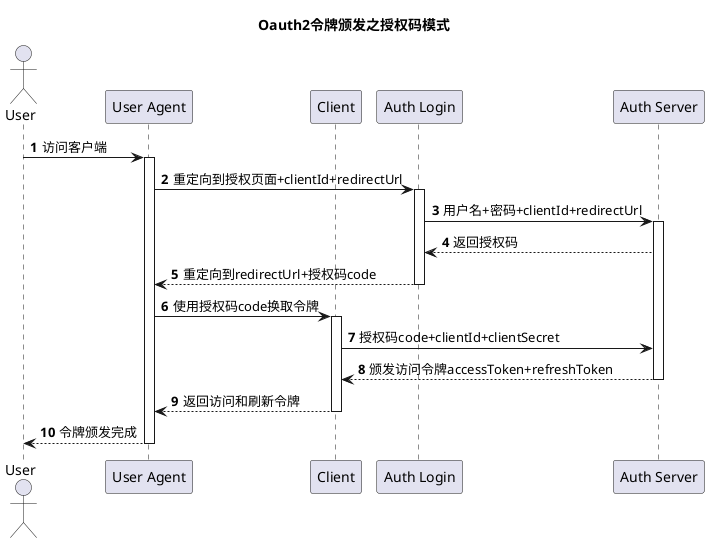

# PHP运行原理

## 概述

3转1执行：*`PHP代码` => 转`Token` => 转`AST抽象语法树` => 转`Opcodes` => `执行opcodes`*

---

1. *通过词法分析得到token*
    1. Token是PHP代码被切割成的有意义的标识。PHP7一共有137种Token，在zend_language_parser.h 文件中做了定义。
2. *基于语法分析器将token转化为`抽象语法树AST`*
    1. Token 就是一个个的词块，但是单独的词块不能表达完整的语义，还需要借助一定的规则进行组织串联。所以就需要语法分析器根据语法匹配 Token，将 Token 进行串联。语法分析器串联完 Token 后的产物就是抽象语法树（AST，Abstract Syntax Tree）。
    2. AST 是 PHP7 版本的新特性，之前版本的 PHP 代码的执行过程中是没有生成 AST 这一步的。它的作用主要是实现了 PHP 编译器和解释器的解耦，提升了可维护性。
3. *将语法树转换为Opcode*
    1. 需要将`AST语法树`转换成Opcode，才能被引擎直接执行。
4. *执行Opcode*
    1. opcodes是opcode的集合形式，是PHP执行过程中的中间代码。PHP工程优化措施中有一个比较常见的 “开启 opcache”，指的技术这里将opcodes进行缓存。通过省去从源码到opcode的阶段，引擎直接执行缓存好的opacode，以提升性能。

## PHP组成部分

从图上可以看出，PHP从下到上是一个4层体系：

1. Zend（Zend引擎，Zend API，Zend拓展API）
    1. 引擎(Zend)+组件(ext)的模式降低内部耦合
    2. Zend引擎：Zend整体用纯C实现，是PHP的内核部分，它将PHP代码翻译（词法、语法解析等一系列编译过程）为可执行opcode处理，并实现相应的处理方法，实现了基本的数据结构（如hashtable、oo）、内存分配及管理、提供了相应的api方法供外部调用，是一切的核心，所有的外围功能均围绕Zend实现。
2. PHP拓展
    1. Extensions：围绕着Zend引擎，extensions通过组件式的方式提供各种基础服务，我们常见的各种内置函数（如array系列）、标准库等都是通过extension来实现，用户也可以根据需要实现自己的extension以达到功能扩展、性能优化等目的（如贴吧正在使用的PHP中间层、富文本解析就是extension的典型应用）
3. sapi(隔绝web server和PHP)
    1. *PHP提供了很多种SAPI，常见的提供给Apache、Nginx、IIS6/7的FastCGI，单独给IIS的ISAPI，以及Shell的CLI*
    2. Sapi全称是Server Application Programming Interface，也就是服务端应用编程接口，Sapi通过一系列钩子函数，使得PHP可以和外围交互数据，*这是PHP非常优雅和成功的一个设计，通过sapi成功的将PHP本身和上层应用解耦隔离，PHP可以不再考虑如何针对不同应用进行兼容，而应用本身也可以针对自己的特点实现不同的处理方式*
4. PHP应用
    1. Application：这就是我们平时编写的PHP程序，通过不同的sapi方式得到各种各样的应用模式，如通过webserver实现web应用、在命令行下以脚本方式运行等等。
    2. 如果PHP是一辆车，那么车的框架就是PHP本身，Zend是车的引擎（发动机），Ext下面的各种组件就是车的轮子，Sapi可以看做是公路，车可以跑在不同类型的公路上，而一次PHP程序的执行就是汽车跑在公路上。因此，我们需要：性能优异的引擎+合适的车轮+正确的跑道。

## Sapi

从图上可以看到，PHP实现了一个典型的动态语言执行过程：*拿到一段代码后，经过词法解析、语法解析等阶段后，源程序会被翻译成一个个指令(opcodes)，然后ZEND虚拟机顺次执行这些指令完成操作*。PHP本身是用C实现的，因此最终调用的也都是C的函数，实际上，我们可以把PHP看做是一个C开发的软件。

1. PHP线程安全和非线程安全有什么区别？
    1. 线程安全在执行时，会进行线程安全检查，用来防止有新要求就启动新要求，耗尽系统资源
2. PHP进程之间的通信机制
3. PHP-FPM和Nginx
    1. nginx和PHP-FPM的通信机制？
    2. php-fpm和nginx两种通信方式的区别？
4. PHP-FPM的进程管理模式
5. PHP-FPM内存泄露问题
6. 为什么PHP-FPM会出现内存泄漏的问题？
7. 如何解决PHP-FPM导致内存泄露的问题？
    1. 对于PHP-FPM多进程的模式，想要避免内存泄漏问题很简单，就是要让PHP-CGI在处理一定数量进程后退出即可。否则PHP应用或者第三方模块（如image magick拓展）导致的内存泄漏问题会导致内存不足
    2. 在PHP-FPM配置文件中，将pm.max_requests这个参数设置小一点；（这个参数的含义是，一个PHP-FPM子进程最多处理pm.max_requests个用户请求后，就会被销毁；当一个PHP-FPM进程被销毁后，他将占用的所有内存都会被回收）
8. php-fpm进程被打满了，原因还是比较复杂的
    1. 直接原因是php-fpm里的`max_children`和`max_requests`等配置开的太大，通过*调小*`进程数`以及`进程最大内存`，可以解决这个问题
    2. 根本原因还是“机器无法满足”
        1. 机器性能太低
        2. PHP实现的服务，本身*有效负载*很低
        3. 什么是有效榨取？*PHP应用通过PHP-FPM这种CGI模式处理请求，每个请求都需要重新加载整个框架，重新创建MySQL/Redis/MQ连接池，最终导致相同QPS下，PHP的CPU很快就被打满了，也就是说，硬件相同的情况下，性能更差。*

# PHP基础

## PHP的changelog？？

### PHP7

- *PHP7的严格模式和类型声明*(标量类型声明，返回类型声明)
- 性能提升(为什么PHP7的性能提升很大？)
    - 变量存储字节减小，减少内存占用，提升变量操作速度
    - 改善数组结构，数组元素和hash映射表被分配在同一块内存里，降低了内存占用，提升了CPU缓存命中率
    - 改进了函数的调用机制，通过优化参数传递的环节，减少了一些指令，提高执行效率
- `try...catch...`（增加多条件判断，分出了exception和error两种异常类型）php7之后可以一次捕捉多种类型的异常和错误，通过|来实现
- `闭包`；支持通过new class类实例化一个匿名类，可以用来代替一些阅后即焚的完整类定义
- `三目运算符的？？`如果有值则取其值，否则则取 $name = $name ？？ 'NoName'
- `飞船运算符`（结合比较运算符）；左边大则返回1；左边小则返回-1；相等则为0
- `常量数组`，PHP7之前只允许类或者接口使用常量数组（也就是说，PHP7之前只能使用const来定义常量数组，之后define()这种也可以使用常量数组）
- `类常量也可以添加“权限修饰符”`
- `iterable伪类型`，iterable类型适用于数组，生成器以及实现了Traversable的对象，他是PHP中的保留类名
- PHP7引入了`可空类型`

### PHP8

- `Attributes`注解

# PHP的其他编译方式

动态编译，静态编译，即时编译

AOT就像C/C++等运行之前就编译好，而JIT则是运行时才进行编译，保证了可移植性的需求

1. OpCode缓存
    1. 什么是OPCode
    2. OPCode缓存和其他缓存有什么区别？
    3. 怎么使用OPCache
2. JIT
3. 直接解析PHP，使用OPcache，使用JIT动态编译，这三者有什么区别？
    1. *正常使用sapi解析PHP*：a.php->经过zend编译->(opcode)->PHP解释器->(机器码)
    2. *使用opcache解析PHP*：a.php->查找opcode缓存->有的话，直接用PHP解释器解析（缓存好的）opcode->机器码->没有就用zend编译为opcode，并且缓存
    3. *使用JIT解析PHP*：a.php->编译->机器码（代码不改变的情况下，都只执行机器码，不再经过zend引擎编译，sapi这两步）

# PHP规范(PSR)

psr有accepted, review, draft, abandoned, deprecated几种

我们只需要知道 “已经在使用的”几种就可以了；

- psr1和psr2都是编码规范
- psr3是日志对接的统一接口
- psr4    自动加载

## psr1, psr2（PHP的代码规范）

1. 文件名要写成大驼峰
2. 换行
    1. SQL过长
    2. 方法或者函数的入参大于三个（，或者|或者&等字符放到后面）
    3. if,declare等控制结构的参数大于三个（，或者|或者&等字符放到后面）
    4. 链式操作超过两个
3. 大小写
    1. 命名空间的首字母大写；
    2. 私有方法或者私有属性，最好下划线开头；private function _privateFunc()
    3. 类，trait，interface都是大驼峰；
    4. 方法和变量都是小驼峰；
    5. 不管是const还是define定义的常量都是全大写；
    6. 函数都是下划线连接；function snake_case(){}
4. 空格
    1. if后面要有空格
    2. 大括号前面要有空格
    3. if判断之后不能有空行
    4. 逗号后面必须要有一个空格
5. 连续调用多个方法(大于3个)使用foreach

## psr4自动加载

1. php自动加载的演进过程？
    1. 直接require文件，（require文件太多，页面打开速度变慢；并且代码不好维护；）
    2. 使用autoload魔术方法实现自动加载；（1，函数不能自定义，必须是__autoload()，2，函数只能加载一次，不能在运行时进行改变；）
    3. 使用spl_autoload_register()；（可以：使用自定义函数进行自动加载； 但是，每次引入外部库的时候，都需要手动维护代码；）
    4. composer解决包依赖的问题，以及版本化控制所有的依赖包；（将spl_autoload_register()里的lib_loader和class_loader通过composer来进行加载；自动生成自动加载代码，不需要手动维护“自动加载代码”）

# PHP多线程

1. php使用多线程？
    1. 并发发起网络请求
        1. curl_multi函数组，如curl_multi_init(), curl_multi_add_handle(), curl_multi_exec()等函数多线程请求网络。适用场景，如多线程下载图片。
        2. stream_socket_client()
    2. 本地并发
        1. 简单一些的可以直接使用异步，可以考虑popen()，fsockopen(), cURL
        2. 复杂一些的，可以考虑PCNTL/pthreads拓展
            1. pcntl_fork()
            2. pcntl_wait()在进程数过多时，回收子进程
        3. 消息队列（本身就是起到异步的作用）。与其他方法不同，把多个请求异步处理，而不是加速一个请求
        4. swoole
2. 为什么php很少使用多线程开发？
    1. php的pthreads多线程拓展不好用
    2. 应用场景。php的主要使用场景是web，没有需要多线程才能解决的需求。（即使需要，也最好用java/golang来编写这部分代码），另外，多线程会引入线程安全之类的新问题，并不比单线程优越。
3. pthreads拓展的问题。
    1. php-fpm本身已经可以多进程，从而充分利用多核进行开发。所以php官方不希望php-fpm进程里使用多线程，造成php-fpm不稳定。
    2. 不能用于Web服务器环境，FPM里用不了，只能用于CLI。
    3. pthreads需要开启ZTS，导致肉眼可见的性能下降。
    4. 无法兼容JIT，因此pthreads作者宣布弃坑，7.4之后不再维护。

## 类型声明type hint

1. 通用的
    1. int
    2. float
    3. bool
    4. string
    5. interfaces
    6. array
    7. callable
    8. iterable
    9. class/interface/self类
    10. 递归类型Traversable
2. 标量类型声明(对象，接口，数组或者callable)
3. 返回类型声明
    1. void仅用在返回值

# PHP函数

## 数组相关函数

### 常用数组函数

- array_keys返回数组中部分键名或者所有键名
- array_key_exists 看数组中是否有指定的键名或者索引
- array_merge合并一个或者多个数组；array_merge_recursive递归地合并一个或者多个数组
- array_pad以指定长度将一个值填充进数组
- array_product计算数组中所有值的乘积
- array_rand从数组中随机取出一个或者多个元素
- array_replace用数组替换第一个数组的元素；array_replace_recursive用数组递归替换第一个数组的元素
- array_reverse返回单元顺序相反的数组
- array_search在数组中搜索给定的值，如果成功则返回首个相应的键名
- array_sum对数组中所有值求和
- array_unique()移除数组中重复的值
- array_values()返回数组中所有的值
- array_chunk()将一个数组分割成多个
- array_column()返回数组中指定的一列
- array_combine()创建一个数组，用一个数组的值作为其键名，另一个数组的值作为其键值
- array_count_values()统计数组中所有的值
- array_fill填充数组；array_fill_keys用键名和键值填充数组
- array_flip交换数组中的键名和键值
- **array_slice从数组中取出一段，array_splice去掉数组中的某一部分并用其他值取代*

### 取差集

- array_diff
- array_diff_assoc, array_diff_uassoc
- array_diff_key, array_diff_ukey
- array_udiff
- array_udiff_assoc, array_udiff_uassoc

### 取交集（取出两个数组相同的部分）

- array_intersect
- array_intersect_assoc, array_intersect_uassoc
- array_intersect_key, array_intersect_ukey
- array_uintersect
- array_uintersect_assoc, array_uintersect_uassoc

### 操作指针

- each()；当前元素的kv
- current()=pos()
- reset()
- end()；当前元素和最后一个元素
- next()，prev()；下一个，上一个

### 常用回调函数

- `array_reduce()`使用回调函数迭代地将数组简化为单一的值
- `array_map()`使用自定义函数对数组中的每个元素做回调处理，自定义函数的返回值为array_map返回的新数组的元素；*以得到一个新数组；*
    - *array_map返回处理完之后的数组（最终得到一个新数组（这也是array_map()和array_walk()之间最大的区别））*
    - array_walk_recursive()...做递归回调处理
- `array_filter()`用回调函数过滤数组中的单元，自定义函数返回true,则array_filter返回的数组保留该元素，否则删除该元素。
- `array_walk()`对给定的数组执行执行自定义函数，array_walk返回true/false，*操作结果影响原来的数组；*
    - array_walk()和array_map一样，把函数，作用于第二个参数（数组里的每一个元素）
- 使用array_map()等数组回调函数，比foreach()的优点有哪些？
    - 使用链式调用的时候，逻辑清晰，可以避免临时变量

### 排序函数

1. sort()/rsort()
    1. sort()对索引数组进行升序排序
    2. rsort()对索引数组进行降序排序；
2. asort()和arsort()是一对
    1. asort()对关联数组按照值进行升序排序
    2. arsort()对关联数组降序；
3. ksort()和krsort()
    1. krsort()按照键名对关联数组进行排序，按照键进行逆向排序，为数组值保留原来的键；成功则返回true，失败则返回false
4. usort(),uasort(),uksort()都是用户自定义排序
5. 自然排序natsort(), natcasesort()

### 容易混淆的数组函数

1. array_search(), in_array(), array_key_exists()的区别？
    1. in_array()只能判断是否存在，返回bool值
    2. array_search()两个参数，要查找的字符串，数组
    3. array_key_exists()在key存在于数组里的石斛返回true；key可以是任何能作为数组索引的值
    4. array_key_exists()的速度比另外两个要快很多，因为key是哈希取得的
2. array+array和array_merge()？
    1. 键名为数字时，array_merge()不会覆盖掉原来的值，但+合并数组则会把最先出现的值作为最终结果返回，而把后面的数组拥有相同键名的那些值“抛弃”掉；（不是覆盖）
    2. 键名字符时，+仍然把最先出现的值作为最终结果返回，而把后面的数组拥有相同键名的那些值“抛弃”掉，但是array_merge()此时会覆盖掉前面相同键名的值
3. empty(), is_null(), isset()区别？
    1. isset()判断变量是否被初始化；并不会判断变量是否为空，并且可以用来判断数组中元素是否被定义过；当使用isset()来判断数组元素是否被初始化时，他的效率比array_key_exists()高4倍左右
    2. empty()检测变量是否为空；任何一个未初始化的变量，值为0或者false或者“”空字符串或者null的变量，空数组，没有任何属性的对象，都将判断为empty==true;is_null()判断变量是否为null

## 字符串相关函数

1. 字符相关函数
    1. strtolower字符串变成小写
    2. strtoupper变大写
    3. ucfirst()把字符串中的首字符转化为大写
    4. lcfirst()把字符串中的首字符转化为小写
    5. ucwords()把字符串中每个单词的首字符变成大写
2. str
    1. strstr()查找字符串在另一个字符串中第一次出现的位置（大小写不敏感）
    2. stristr()查找字符串在另一个字符串中第一次出现的位置（大小写不敏感）
    3. strchr()/strstr()查找字符串在另一个字符串中第一次出现的位置（大小写不敏感）
    4. strrchr()查找字符串在另一个字符串中最后一次出现的位置
3. pos
    1. strpos()第一次出现的位置（大小写敏感）
    2. stripos()第一次出现的位置（大小写不敏感）
    3. strrpos()查找字符串在另一个字符串中*最后一次*出现的位置（大小写敏感）
    4. strripos()查找字符串在另一个字符串中最后一次出现的位置（*大小写不敏感*）
4. replace
    1. str_replace()替换字符串中的一些字符（大小写敏感）
    2. str_ireplace()替换字符串中的一些字符（大小写不敏感）
    3. substr_replace()把字符串的一部分替换成另一个字符串，三个参数
5. slashes
    1. addslashes()在预定义的字符前面加反斜杠
    2. addcslashes()在指定的字符前面加反斜杠
6. cmp
    1. strncmp()前n个字符的字符串比较（大小写敏感）
    2. strncasecmp()前n个字符的字符串比较（大小写不敏感
    3. strnatcmp()...(大小写敏感)
    4. strnatcasecmp()使用一种“自然排序”算法来比较两个字符串；（大小写不敏感）
7. 打印输出
    1. vfprintf()把格式化的字符串写到指定的输出流
    2. print()输出一个或者多个字符串
    3. printf()输出格式化的字符串
    4. sprintf()把格式化的字符串写入一个变量中
        1. sprintf('%02d', $month)
    5. vprintf()输出格式化的字符串
    6. vsprintf()把格式化的字符串写入变量
    7. fprintf()把格式化的字符串写入到指定的输出流
8. 容易混淆的字符串函数
    1. strtr()和str_replace()的区别
        1. strtr()性能比str_replace()高，但是实用性低，所以能用strtr的时候才用
        2. strtr区分大小写，而str_replace()不区分大小写
        3. strtr的第二个参数可以是数组

## 数字相关函数

1. 有哪些常见的计算函数？
    1. fmod()求余
    2. pow()x的y次方
    3. round()四舍五入
    4. ceil()向上取整
    5. floor()向下取整
    6. sqrt()平方根
2. PHP运算时为什么会精度丢失？
    1. 生活中使用十进制，但是计算机使用二进制。*所有十进制整数都可以转换成二进制整数，但是二进制中表示十进制的小数就比较麻烦了*
    2. *单精度和双精度的浮点数只包括7位或者15位的有效小数位，存储需要无限位表示的小数时只能存储近似值*
3. PHP精度丢失，有哪些解决方案？
    1. *任何需要十进制运算的地方，都需要用decimal取代float*
    2. 使用PHP的高精度拓展`BC Math`
4. `BC Math`怎么使用？
    1. bcadd()
    2. bcsub()
    3. bcmul()
    4. bcdiv()

## 文件相关函数

1. is_file()和file_exists()
    1. 文件存在的情况下，is_file更快。文件不存在的情况下，file_exits()更快。
2. filesize()取得文件大小
3. is_readable()判断文件是否可读
4. is_writable()判断文件是否可写
5. is_executable()判断文件是否可执行
6. filectime()
7. filemtime()
8. fileatime()获取文件的上次访问时间
9. stat()获取文件大部分属性值

# PHP垃圾回收

1. RC是什么？
2. RC的问题？
    1. 如果多个对象互相引用，那么内存对象的计数器永远都不会变成0，如果这些变量已经没用了，就会导致内存泄漏。
3. 同步回收算法CCRC(Concurrent Cycle RC)
    1. 把RC算法里的简单计数器改为了一套可以检测出对象互相引用的算法，并且加入了“根缓冲区”，当“根缓冲区”满了之后，执行一次GC，从而将内存占用限制在一个阈值里。
4. 与垃圾回收算法相关的PHP配置
    1. 修改php.ini中的zend.enable_gc来打开或关闭PHP的垃圾回收机制
    2. 通过调用gc_enable()或gc_disable()打开或关闭PHP的垃圾回收机制
    3. 在PHP5.3中即使关闭了垃圾回收机制，PHP仍然会记录可能根到根缓冲区，只是当根缓冲区满额时，PHP不会自动运行垃圾回收，当然，任何时候您都可以通过手工调用gc_collect_cycles()函数强制执行内存回收。

## PHP的引用计数+同步回收算法的具体流程？

1. 首先PHP会分配一个固定大小的`根缓冲区`，用于存放固定数量的zval，当`根缓冲区`满额时，PHP就会执行垃圾回收；具体流程如下:
2. 对每个`根缓冲区`中的`根zval`按照`深度优先遍历算法`遍历所有能遍历到的zval，并将每个zval的refcount减1，并将其标记为“已减”;(为了避免对同一zval多次减1(因为可能不同的根能遍历到同一个zval))
3. 再次对每个缓冲区中的根zval深度优先遍历，如果某个zval的refcount不为0，则对其加1，否则保持其为0。
4. 清空`根缓冲区`中的所有根(注意是把这些zval从缓冲区中清除而不是销毁它们)，然后销毁所有refcount为0的zval，并收回其内存。

## “同步回收”具有以下几点特性

1. 并不是每次refcount减少时都进入回收周期，只有根缓冲区满额后才开始GC；
2. 可以解决循环引用问题。
3. 可以将内存泄露保持在一个阈值以下；

## 怎么评价rc这种gc算法？（重要）

1. *rc的问题在于，虽然不会stw，但是因为设定了阈值，所以吞吐量上不去，这也是为什么不要使用rc的原因*，所以，还是应该好好分析*以JVM为代表的典型GC发展历程*，*从单线程到并行再到并发*，*从单一内存池到分代再到分区*，*从CMS到G1再到ZGC*分别解决了哪些问题

## PHP的内存管理机制（同步回收算法）

预先给出一块空间，用来存储变量，当空间不够时，再申请一块新的空间；
PHP是会自动释放内存的，当PHP执行完成后，自动释放该次请求的所有内存。
php.ini里设置的是单次请求最大允许的内存分配，
如果本次请求内存超过设置，
那么，PHP会因为内存无法分配导致程序崩溃而结束请求；14

1. 为什么PHP不使用JAVA等语言使用的分代回收算法来实现GC？
2. 引用计数这种GC有什么问题？
    1. *rc的问题在于，虽然不会stw，但是因为设定了阈值，所以吞吐量上不去*
    2. 应该好好分析*以JVM为代表的典型GC发展历程*，*从单线程到并行再到并发*，*从单一内存池到分代再到分区*，*从CMS到G1再到ZGC*分别解决了哪些问题？

# PHP的OOP

## 变量

1. 预定义变量
    1. 全局变量(全局预定义变量)在函数外部定义的变量，它的作用域从定义的地方到文件结尾
        1. $GLOBALS：global全局变量，是一个包含了所有全局变量的组合数组，全局变量的名称就是该组合数组的键。
        2. $_GET：HTTP GET 变量，通过 URL 参数传递给当前脚本的变量的数组。
        3. $_POST：HTTP POST 变量，通过 HTTP POST 方式传递给当前脚本的变量的数组。
        4. $_COOKIE：HTTP Cookies 变量，通过 HTTP Cookies 方式传递给当前脚本的变量的数组。
        5. $_SESSION：session 变量，当前脚本可用的 SESSION 变量的数组。
        6. $_REQUEST：HTTP Request 变量，默认情况下包含了 $_GET，$_POST 和 $_COOKIE 的数组。
        7. $_FILES：HTTP 文件上传变量，通过 HTTP POST 方式上传到当前脚本的项目的数组。
        8. $_SERVER：服务器信息变量，包含了诸如头信息(header)、路径(path)、以及脚本位置(script locations)等信息的数组。这个数组中的项目由 Web 服务器创建。
        9. $_ENV：环境变量，通过环境方式传递给当前脚本的变量的数组。
    2. 局部变量(局部预定义变量)在函数内部定义的变量，它的作用域为函数定义范围内。
        1. `$php_errormsg`：前一个错误信息，$php_errormsg 变量包含由 PHP 生成的最新错误信息。这个变量只在错误发生的作用域内可用，并且要求 track_errors 配置项是开启的（默认是关闭的）。
        2. `$HTTP_RAW_POST_DATA`：包含 POST 提交的原始数据。
        3. `$http_response_header`：HTTP 响应头，$http_response_header数组与 get_headers() 函数类似。当使用HTTP包装器时，$http_response_header 将会被 HTTP 响应头信息填充。
        4. `$argc`：传递给脚本的参数数目，包含当运行于命令行下时传递给当前脚本的参数的数目。脚本的文件名总是作为参数传递给当前脚本，因此 $argc 的最小值为 1，这个变量仅在 register_argc_argv 打开时可用。
        5. `$argv`：传递给脚本的参数数组，包含当运行于命令行下时传递给当前脚本的参数的数组。第一个参数总是当前脚本的文件名，因此 $argv[0] 就是脚本文件名，这个变量仅在 register_argc_argv 打开时可用。
2. 在PHP7怎么在声明变量时赋值而不报错？
    1. 属性中的变量可以初始化，但是初始化的值必须是常数，这里的常数是说PHP脚本在编译阶段就可以得到其值，而不依赖其他函数处理才能求值。

## 常量

1. PHP魔术常量都有哪些？
2. PHP预定义常量都有哪些？
3. 怎么定义常量？（const和define）
    1. Const关键字在类内定义常量，define在类外定义常量

## 修饰符

1. 有哪些`访问权限修饰符`？
    1. public
    2. protected
    3. private
    4. final
    5. static
2. final修饰符是什么？
    1. final可以修饰类，方法，属性
    2. final类不可被继承，不能被重写(被final修饰的类不能被继承，只能被实例化)
    3. final方法不可被覆盖(属性不能被定义为final，只有类和方法才能被定义为final)
    4. final不能修饰抽象类和接口类
3. 使用`静态方法`的好处？
4. PHP中静态方法和非静态方法的使用及区别？举例说明静态方法的好处？
5. 为什么$this能够访问到静态方法呢？

## PHP运算符

1. 三元运算符
    1. 写法1`$a = $a ？ $a : 1;`
    2. 写法2`$a = $a ？ : 1`PHP5.3引入
    3. 写法3`$a = $a ？？ 1`PHP7引入
    4. `$padLength = $type == 'year' ？ 4 : 2;`
2. 类型运算符
    1. 用instanceof来判断一个PHP变量是否属于某一类class的实例
    2. instanceof也可用来确定一个变量是不是继承自某一父类的子类的实例
3. 赋值运算符
4. 逻辑运算符
    1. AND和&&的区别？
    2. OR和||的区别？
    3. 注意逻辑运算符的优先级：运算符优先级中，or 和 ||，&& 和 and 都是逻辑运算符，效果一样，但是其优先级却不一样
5. 组合比较符(太空船运算符)
    1. 组合比较运算符可以轻松实现两个变量的比较，当然不仅限于数值类数据的比较。

## 流程控制

1. 判断
    1. if...else
    2. elseif/else if
2. 循环
    1. while
    2. do-while
        1. do...while和while的区别在于保证do里的循环语句保证执行一次，而不是像while一样，先检查再执行
    3. for
    4. foreach
        1. `$infos as $key => $info`
        2. `$infos as $info`
        3. 多维数组；循环套循环
        4. 循环+判断
        5. &的应用；$data as &$key是什么意思？
        6. break
    5. continue
3. 其他
    1. switch
    2. `declare`
    3. return
    4. require
    5. include
    6. require_once
    7. include_once
    8. goto

## 魔术方法

`4*2 + 2*4 = 16`

__construct()和__destruct()

- __construct()
- __destruct()

__call()和__callStatic()

- __call()；在对象中调用一个不可访问的方法时，会调用； 对象调用某个方法，若方法存在，则直接调用；若不存在，则会去调用__call函数。
- __callStatic()；用静态方式调用一个普通方法时，会调用*比如facade*

__sleep()和__wakeup()

- __sleep()；serialize之前被调用。若对象比较大，想删减一点东东再序列化，可考虑一下此函数。
- __wakeup()；unserialize时被调用，做些对象的初始化工作。

__clone()/__invoke()

- __clone()；克隆对象时被调用。如： `$t=new Test(); $t1=clone $t;`
- __invoke()；*以调用函数的方式调用一个对象时*，__invoke()方法会被自动调用

---

__set()/__get()/__isset()/__unset()

- __set()；方法用于设置私有属性值。（设置一个对象的属性时，若属性存在，则直接返回属性值；若不存在，则会调用__get函数。）
- __get()；方法用于获取私有属性值。（ 读取一个对象的属性时，若属性存在，则直接赋值；若不存在，则会调用__set函数。）
- __isset()；方法用于检测私有属性值是否被设定。（isset()一个对象的属性的时候被调用）
- __unset()；方法用于删除私有属性。（unset()一个对象的属性时被调用）

__autoload()/__toString()/__set_state()/__debugInfo()

- __autoload()；实例化一个对象时，如果对应的类不存在，则该方法被调用。
- __toString()；打印一个对象的时被调用。如 `echo $obj`或`print $obj`
- __set_state()；调用var_export时，被调用。用__set_state的返回值做为var_export的返回值。
- __debugInfo()

## 类

### 抽象类和接口类

1. 抽象类里可以没有抽象方法吗？
    1. 抽象类中可以没有抽象方法（全部都是普通方法），那么，抽象类和普通类的区别就在于：抽象类只能继承，不能实例化。
2. 抽象类和接口类的区别？
    1. 接口类就是一个类的领导者，指明方向，子类必须完成他指定的方向，就是要实现什么都已经规定好了。抽象类就是把相同的抽出来了，不需要必须使用，继承的时候使用extends继承。
    2. 接口类是一个特殊的抽象类
    3. 接口继承用implements，抽象类继承用extends
    4. 接口类不能声明变量，只能声明常量；抽象类可以声明变量。
    5. *接口类没有构造方法，抽象类可以有*
    6. 一个类可以继承多个接口类，但只能继承一个抽象类；
    7. 接口类的每个方法都只有声明，而没有实现；他的每个方法，实现类都必须要实现；而抽象类中只需要实现抽象方法，其他方法可以实现也可以不实现

### Trait可复用类

*Trait解决了PHP不能多继承的问题，“看起来像interface，但是用起来像class的东西”*

1. 如果两个trait里有同名方法或者属性怎么办？
    1. 使用instanceof()和as来解决
    2. *instanceof()关键字用前者取代了后者，as关键字给被取代的方法起了一个别名*
2. 怎么看待trait？
    1. trait相比于多继承；多继承有类型分裂的问题，
    2. 要评价trait，首先需要解决以下几个问题
        1. 我们为什么需要引入多重继承？
        2. 引入多重继承是为了解决什么问题？
        3. 同时引入多重继承又带来了什么问题？

### 预定义类

1. PHP有哪些预定义类？
    1. Directory
    2. Closure闭包类
    3. Exception
    4. Error
        1. ArithmeticError
        2. AssertionError
        3. DivisionByZeroError
        4. ParseError
        5. TypeError
    5. Throwable

### 预定义接口

1. PHP有哪些预定义接口类？
    1. `Generator`生成器
    2. `ArrayAccess`数组式访问
        1. ArrayAccess这个预定义接口类的作用在于，让对象可以像数组一样可以被访问
    3. `JsonSerializable`序列化
    4. `Closure`闭包
    5. `Traversable`遍历（检测一个类是否可以使用 foreach 进行遍历的接口）
    6. `Iterator`迭代器接口（可在内部迭代自己的外部迭代器或类的接口）
        1. `IteratorAggregate聚合式迭代器接口`（创建外部迭代器的接口）
        2. `OuterIterator迭代器嵌套接口`（将一个或多个迭代器包裹在另一个迭代器中）
        3. `RecursiveIterator递归迭代访问接口`（提供递归访问功能）
        4. `SeekableIterator可索引迭代访问接口`（实现查找功能）

generator可以以一种简单的方式实现iterator。*generator实现通过yield关键字完成，提供了一种简单的方式实现iterator，几乎没有任何额外开销或者需要通过实现iterator接口的类这种复杂方式实现迭代*

玩过node和python的同学都知道yield这个关键字，借助yield的上下文运行时的切换，可以做到协程的效果，能够大大*减少内存的使用量以及效率*。比如导出和导入大量数据的时候，可以使用生成器避免内存爆出。具体看鸟哥的介绍在此，这里我们直接上代码了

当一个函数包含 yield，那么这个函数即不再是一个普通函数，它永远返回一个「Generator (生成器)」实例。生成器实现了 Iterator 接口，这就是为何它能够进行 foreach 遍历的原因。

## 闭包

1. 闭包是什么？
2. 为什么要用闭包？
3. 实现闭包的几种方法？
    1. use方法
    2. bindTo方法

## PHP的异常处理？

错误和异常是两码事

1. PHP的异常处理
    1. try-catch
        1. php7之后才有的throwable
    2. throwable
    3. exception
        1. BadFunctionCallException
        2. BadMethodCallException
        3. DomainException
        4. InvalidArgumentException
        5. LengthException
        6. LogicException
        7. OutOfBoundsException, OutOfRangeException, RangeException
        8. OverflowException
        9. RuntimeException
        10. UnderflowException
        11. UnexpectedValueException

## 引用

1. 引用是什么？什么作用？
    1. 遍历一个数组获取新的数据结构
    2. 传递一个值到一个函数中获取新的值
2. 引用传递
3. 引用返回
4. 取消引用
5. 引用定位

---

1. 后期静态绑定
    1. static可以用来静态延迟绑定，运行时再绑定
2. 重写
3. 可变参数和参数拆包
    1. 如果传一个不定长的字符串，那么会使用可变参数；自动处理为一个数组
    2. 如果传一个数组；使用参数拆包
4. PHP如何实现链式调用？
    1. __call+call_user_func()实现
    2. __call+call_user_func_array()实现
    3. 不需要__call，直接在该函数里返回$this(最后一种最方便)

# PHP工具

`php artisan code:analyse --level=4`
`php artisan l5-swagger:generate`
`php-cs-fixer fix $PWD --config=cs.php`

`composer dump-autoload & php artisan optimize & php artisan cache:clear & php artisan config:clear & php artisan route:clear   & php artisan view:clear & php artisan api:cache & php artisan config:clear`

## composer

1. **composer自动加载原理？**(有时间自己实现一下自动加载)
    1. 把composer包名字写到require里，执行update，具体是怎么把包自动加载到laravel里的？能不能说一下？
2. composer.json文件里都有什么？
    1. PSR-0(已过时)
    2. PSR-4(composer的标准自动加载方式)
    3. class-map
    4. 直接包含file
3. composer的版本约束？
    1. 比较操作符来约束版本；>，>=，<，<=，!=
    2. 使用连字符来约束版本；1.0 - 2.0
    3. 通配符来约束版本；1.0.*
    4. 使用^锁定大版本
        1. ~1.2.3相当于>=1.2.3 <1.3.0
    5. 使用~锁定小版本；
        1. ^1.2.3相当于>=1.2.3 <2.0.0
    6. dev-分支名；这样指定版本的意思是，对应分支下的最新提交
4. composer常用命令
    1. 移除不需要的包：composer remove package_name
    2. 展示这个项目里所有安装的包：composer show
    3. 更新所有（或者单个包）的依赖关系：composer update package
    4. 清除所有的composer缓存：composer clear-cache
    5. 更新到最新版本：composer self-update
    6. 检查常见的问题：composer diagnose
    7. 如果laravel的类没有正常引入，执行composer dump-autoload，再引入一遍
5. 怎么开发Composer包？实战

## PHP常用工具

### 代码规范工具PHP-CS-Fixer

1. 怎么安装`PHP-CS-Fixer`？ 使用homebrew安装`php-cs-fixer`，用`php-cs-fixer fix dir`直接修复
2. 怎么使用phpcs+githook+StyleCI来保证代码规范？

### 静态检查工具

1. phpstan
    1. 和cs-fixer一样，一种是作为服务，一种是作为一个laralve的composer包；建议作为服务使用，以免影响生产环境性能，当然作为包使用更方便
    2. larastan
2. 其他工具比如phplint、phpqa、grumPHP

### 性能分析工具

1. *都不太靠谱，差不多能用的只有`xhprof/xhgui`，其他的仅做整理*
2. 本地服务比如z-ray、tideways+xhgui、kint、`blackfire`
3. 在线服务，比如oneapm、`new-relic`

怎么安装xhprof拓展并配置

1. 安装tideways拓展
2. 安装并部署xhgui-branch这个项目，作为展示xhprof的web页面；
3. 在想要做性能分析的项目的nginx配置里，先执行xhgui

### PHP有哪些代码加密的方法？

*总的来说分成`免拓展加密`和`有拓展加密`，两个的代表分别是`phpjiami`和`swoole-compiler`*

- 免拓展加密(phpjiami)
- 有拓展加密(swoole compiler加密)Swoole Compiler是Swoole官方推出的PHP代码加密和客户端授权解决方案，通过业内先进的代码加密技术（流程混淆，花指令，变量混淆，函数名混淆，虚拟机保护技术，扁平化代码，sccp优化等）将PHP程序源代码编译为二进制指令，来保护您的源代码

## phpunit

1. 断言有哪几种？
2. **phpunit.xml文件说明**
3. laravel的tests文件夹的结构？
    1. tests的两个子目录，Feature用来功能测试，Unit用来单元测试；
    2. 单元测试专注于小的，相互隔离的代码；
    3. 而功能测试可用于测试较大区块的代码，包括若干组件之前的交互，甚至一个接口的请求；
4. 单元测试的标准？
    1. 100%覆盖
    2. 自动化测试
    3. 变化的业务，不变的接口
    4. 单元测试和集成验收测试的关系
5. php有哪些stub库？
    1. mockery
    2. `orchestral/testbench`
6. 有哪些stub？
    1. 虚设替身：只传递但是不会使用到的对象，一般用于填充方法的参数列表
    2. 存根替身：总是返回相同的预设响应，其中可能包括一些虚设状态
    3. 伪装替身：可以取代真实版本的可用版本。举个例子，就是写一个对方接口的预期返回，用来测试。
    4. 模拟替身：可以表示一系列期望值的对象，并且可以提供预设响应
7. 多环境下，怎么使用对应环境的phpunit？
8. 怎么模拟认证用户？
9. 文件上传怎么单测？
10. 有哪些对于phpunit的增强方案？
    1. phpunit美化，使用`phpunit-pretty-result-printer`这个包实现对phpunit结果的美化。
    2. 使用semaphore对phpunit持续集成
    3. phpunit测试覆盖率

# laravel

## 111

- laravel里如何直接使用db的json类型？ 如果字段是meta，可以直接用meta->name这种方法取出；读操作和写操作都可以使用
- laravel不读某个字段？用$hidden属性在model里设置隐藏字段和安全字段
- laravel的$appends属性怎么用？appends属性用来临时添加某个数据库里没有的字段，实现动态修改模型，使用getColumnAttribute()来定义字段数据
- 同一个model使用不同connections连接不同数据库，使用事务时，即使报错也无法回滚，怎么处理？ `DB::connection('some_connection')->beginTransaction();`
- laravel单元测试的文件上传？ `$fakeImg = UploadedFile::fake()->image('temp.jpg');`
- laravel里多对多的写入和查询怎么做？
- laravel里服务容器的工作原理？
- laravel的elq关联关系中的loadMissing()和getDirty()方法的区别？
- laravel里多态关系的表单验证
- laravel怎么添加自定义校验规则？ 在AppServiceProvider里通过Validator::extend注册自定义规则，如果规则比较复杂，也课可以通过make:rule生成一个对应的自定义规则类。

---

laravel里model属性的隐藏，展示和临时隐藏？

1. $hidden
2. $visible
3. 临时隐藏：return $user->makeVisible('attribute')->toArray();

---

php如何保留两位小数？

1. `round($num,2)`
2. `sprintf("%.2f",$num)`
3. `number_format($num, 2)`
php如何返回随机小数？

## Laravel核心

- laravel里使用了哪些设计模式？
- laravel文件夹结构
- laravel的工作原理？laravel路由加载原理？

### 路由分发

- 接收HTTP请求
- 由HTTP内核处理HTTP请求
- 路由分发处理（路由分发流程）
- 执行路由闭包或者控制器（运行控制器方法，补充说明）

## 服务容器

1. 为什么要用service-container呢？
    1. laravel的sc是用来`管理类的依赖`和`执行依赖注入`的工具
    2. 依赖注入就是，类的依赖项通过构造函数，或者某些情况下通过setter方法注入到类里
2. 绑定
    1. 简单绑定bind()
    2. 绑定单例singleton()
        1. `singleton` 方法将类或接口绑定到只能解析一次的容器中。绑定的单例被解析后，相同的对象实例会在随后的调用中返回到容器中
    3. 绑定实例instance()
        1. 也可以使用instance()方法，将现有对象实例绑定到容器中；给定的实例会始终在随后的调用中返回到容器中
    4. 绑定初始数据$this->app->when()->needs()->give()
        1. 当你有一个类不仅需要接受一个注入类，还需要注入一个基本值（比如整数）。你可以使用上下文绑定来轻松注入你的类需要的任何值
    5. 绑定接口到实例
        1. sc有一个强大的功能，就是将接口绑定到给定实现
        2. 如果我们有一个 `EventPusher` 接口和一个 `RedisEventPusher` 实现。编写完接口的 `RedisEventPusher` 实现后，我们就可以在sc中注册它
    6. 上下文绑定
        1. 有时候，你可能有两个类使用了相同的接口，但你希望每个类都能注入不同的实现。
        2. 例如，两个控制器可能需要依赖不同的`contract契约`实现。
    7. 标记
        1. 有时候，你可能需要解析某个「分类」下的所有绑定。例如，你正在构建一个报表的聚合器，它接收一个包含不同 `Report` 接口实现的数组。注册了 `Report` 实现后，你可以使用 `tag` 方法为其分配标签
        2. 服务被标记后，你可以通过 `tagged` 方法轻松地将它们全部解析
3. 解析
    1. make()方法
        1. 用$this->app->make()方法把sc里的类实例解析出来；
        2. make()的参数是，要解析的类或者接口的名称
        3. 如果一些类的依赖项不能通过容器去解析，可以通过将他们作为关联数组，传递到makeWith()方法来注入他们
    2. 自动注入
4. 容器事件
    1. 每当sc解析一个对象时，触发了一个事件；可以使用resolving()来监听这个事件
    2. 被解析的对象会被传递给回调函数里，让你在对象被传递出去之前，可以在对象上设置任何属性

## 服务提供器

1. laravel为什么需要service-provider
2. register()
    1. register()就是service-provider用来往service-container里注册服务的
3. boot()
    1. boot()是用来启动（事件监听之类的）相关服务
    2. boot()调用的时候，sc里所有注册的sp都已经加载完了，所以可以随便调用sc里的任何一个sp，也可以在boot()方法中，类型提示依赖，sc会自动注册所需要的依赖
4. provides()和$defer
    1. defer属性是用来延迟加载该sp的register()方法的
    2. defer和provides()通常搭配使用
5. service-provider的加载和执行过程

## Facades

- facade是什么？
- facade的工作原理？
- laravel是怎么实现facade的？

## 队列

- 多个laravel同时运行时，队列互串的问题，怎么解决？
- laravel里如何限制队列执行频率和队列长度？
- laravel里队列，如何给不同的队列设置不同的list？如何修改某个队列的driver？ 这块还要注意trait属性不能通过重新定义直接重写的问题，最好在构造方法里重写
- 消息推送是否应该放到队列里？队列里应该放什么逻辑？ 应该放耗时任务，一些逻辑无关的业务，一些错误容忍性高的业务。比如一些使用了与逻辑无关的第三方应用（比如消息推送，一次两次的失败是可以接收的；当然，一些与逻辑有关的第三方应用应该做好容错）
- laravel队列的fail, retry, delay

## 怎么优化Laravel框架？

这不仅仅是针对Laravel网站的性能优化方法，其中很多是通用的网站性能优化的方法，当然还有很多可以优化的地方；

1. 使用缓存
    1. 使用内存缓存作为会话的dirvier
    2. 文件缓存
    3. 数据库缓存
    4. Redis缓存
2. 服务端代码优化
    1. 数据库请求优化（数据关联模型读取的时候，使用`延迟预加载`和`预加载`）
3. 加一些服务
    1. 使用swoole
    2. 使用HHVM这个JIT；能轻轻松松的让你的应用程序在不用做任何修改的情况下，直接提高 50% 或者更高的性能
    3. 使用OPcaache
    4. Nginx开启gzip压缩

4. `瓶颈`。laravel的性能瓶颈不在于laravel的性能瓶颈在于数量众多的文件引用，反映到系统上就是磁盘I/O能力。
5. `lumen？`laravel无法无缝切换到lumen，且切换到lumen，性能也只是五十步笑百步。
6. `hyperf`php生态内可以考虑hyperf，不考虑其他框架层面方案。

# laravel接口

*虽然dingo+jwt+fractal提供的服务（比如，接口限流，fractal提供的数据返回），laravel现在本身都已经提供了，但是这三件套仍然是laravel下接口的最佳实践；*

1. `dingo`用来实现接口的路由版本管理，dingo内置的异常处理，以及最常用的transformer；
    1. transform
    2. 接口的版本管理；前缀与子域名
    3. 多种认证方式
    4. 接口限流
    5. Http Exception处理
2. `jwt-auth`用来实现用户认证
3. `fractal`实际上就是dingo默认的transformer层

## JWT-Auth

1. 常见问题
    1. jwt是什么？
        1. header说明了加密算法
        2. payload里exp是过期时间，sub是jwt的主体，通常是用户的id
        3. sign是由服务器进行的签名，保证token不被篡改
    2. 如果使用jwt作为客户端到服务端的验证？
        1. 获取客户端提交的 token
        2. 检测 token 中的签名 signature 是否正确
        3. 判断 payload 数据中的 exp，是否已经过期
        4. 根据 payload 数据中的 sub，取数据库中验证用户是否存在
        5. 上述检测不正确，则抛出相应异常
    3. 如果jwt被截取了，怎么办？假设一个场景，黑客抓到了用户a的jwt，使用用户a的jwt进行各种操作，怎么办？
    4. token的验证流程？要看源码
2. 实战
    1. 安装jwt以及配置
    2. 为什么需要刷新token？
        1. *因为设置有效期后，token会失效，所以需要刷新token*
    3. 怎么使用刷新token？
    4. 如果刷新token过期了，怎么办？
        1. 如果refresh token过期，就需要用户重新登录了
        2. 当然还可以把这个机制设计得更复杂一些，比如，Refresh Token 每次使用的时候，都更新它的过期时间，直到与它的创建时间相比，已经超过了非常长的一段时间（比如三个月），这等于是在相当长一段时间内允许 Refresh Token 自动续期。
    5. jwt-auth黑名单
    6. laravel+dingo的第三方登录
    7. jwt怎么实现多表多用户系统的隔离？

## Fractal

1. fractal的基本使用？
    1. *DAS数据的结构是统一的，无论输出集合还是单条数据，都是data和meta；而AS在输出单条数据时，没有data这层；相比之下，我们的使用频率；DAS>AS>JAS*
2. 怎么直接切换fractal提供给我们的三种数据结构？
    1. 在`\App\Providers\AppServiceProvider`里的`boot()`里加这个方法
3. 如何返回自定义格式的接口？
    1. 在\App\Providers\AppServiceProvider::boot里，加一个fractal()方法，在这里就把数据格式进行转换
    2. 写一个自定义的CustomSerializer类，来起到自定义格式的作用
    3. 修改`config/api.php`里的`errorFormat`

接口开发

# laravel与接口

## 接口设计

- 分版本。为后面接口升级做好打算。
- 提供密钥和token。确保数据不被篡改。
- `restful风格`。读数据用get，修改数据用post。
- 接口返回值格式统一结构。
- 用JSON格式输出，记得写好头信息。如楼上所写的。
- `接口记录日志`。记录请求参数、占用内存、响应时间、响应时长。方便后续优化。
- `提供统一的错误码`。每个数字代表一种错误，需要在文档中说明。错误分系统错误和业务逻辑错误。
- `建立接口文档`。记录每个接口的用途，参数列表，返回值说明。同时给出使用例子。

## 请求合法性

*请求合法性指的是该请求是否合法，包括该接口是否有token，token是否正确，以及接口的防重放攻击等*

### 防重放攻击

#### 有哪些防重放攻击的方法？

1. 验证：nonce+timestamps+sign生成随机串来防重
2. 入库：缓存层的原子性（redis的计数器）和数据库层的唯一索引

#### nonce/timestamps/sign分别是什么？

1. timestamp发送接口的失效时间
2. nonce是随机串
3. sign是对某项数据（比如uid）timestamp nonce的加密串

#### 随机串防重，服务器验证流程？

1. 先验证sign签名是否合理，证明请求参数没有被修改过
2. 再验证timestamp是否过期，证明请求是最近60s内被发出的
3. 最后验证Nonce，证明这个请求不是60s内的重放请求

#### 如果不同时使用这三个参数，各自都有什么问题？

1. 只用timestamp，60s内都可以重放攻击。没使用算法，很容易被破解
2. 只用nonce，存储nonce的集合会越来越大，验证nonce是否存在于这个集合的耗时会越来越长
3. 用timestamp+nonce

### 请求数据合法性

### 请求认证(Authorization)(鉴权)

#### 有哪些认证方法？

1. Basic Auth, JWT, OAuth等几种不同的认证方法有什么区别？

#### OAuth协议

##### OAuth协议是什么？

1. OAuth是一个关于授权的开放网络标准，允许用户让第三方应用访问该用户在某一网站上存储的私密的资源，而无需将用户名和密码提供给第三方应用

##### OAuth协议的工作原理？

1. 用户（这里是指属于服务方的用户）
2. 服务方（如微信、微博等）
3. 第三方应用

##### OAuth2有哪几种授权模式？

*总结一下，授权码模式和简化模式适用于大型网站，客户端模式很少被使用，主流是密码模式*

- *密码模式*(User Credentials)，适用于不同服务端的应用
- 客户端模式(Client Credentials)，适用于不以用户为单位来进行认证的应用
- 简化模式(Implicit)，适用于在js上使用
- 授权码模式(Authorization Code)，适用于在服务端上使用

## 数据加密

1. 为什么需要数据加密？
    1. 使用token只能起到鉴权的作用
    2. 使用https能保证在传输层请求不被篡改和完整性
    3. 接口做数据加密才能起到防止伪造和重放
2. 有哪些数据加密方法？
    1. laravel内置加密
    2. `phpseclib`
    3. openssl
    4. 私有协议二进制打包(比如微信就通过这种方式进行加密，很麻烦，不多说)
3. 加密解密流程？
    1. 一种比较好的解决方案就是在客户端请求发起之前先对要请求的数据进行加密，服务端api接收到请求数据后再对数据进行解密处理，返回结果给客户端的时候也对要返回的数据进行加密，客户端接收到返回数据的时候再解密。
4. 为什么抓包软件能看到明文的https？（重要）
    1. *https是在 传输阶段进行加密的，但你本机用抓包软件抓 是在你数据还没进到网卡传送数据之前直接就已经被截获了，所以说 你自己抓自己的就可以 但你要抓别人的 就不可以，这是常识。*
    2. *所以我们需要对明文数据进行加密，再进行https加密传输，确保数据在传输过程中和本地都是加密的；*

## 接口升级

1. 接口分版本有两种方法
    1. 一种是通过`路由和前缀`，映射到不同的命名空间来实现分版本
    2. 另一种是通过`header里的Accept参数`写入不同版本的参数，来实现分版本
2. 版本升级的规范：(版本升级要遵循开闭原则，这里有两种比较常见的做法，仅供参考：)
    1. 单机场景；一个站点兼容所有的版本，但是这种方法因为没有明确地分出版本，所以之后的代码会影响之前的代码，产生bug
    2. 多机场景；不同版本部署在不同的服务器上
3. 大版本和小版本的问题
    1. 对于小版本的修改，最好可以在原接口中做兼容；（比如v1.0.1和v1.1.0使用不同参数时，服务端通常应该只增不删不改（*开放封闭*，对扩展开放，对修改封闭），把参数统一返回，即可同时兼容不同的移动端版本）
    2. 大版本直接分文件夹。

我们要*把不同的版本做成不同的分支，比如项目开始只有test, pre, master，但是一旦v1封版了，就应该把当前master的代码做成v1_master分支*（除非有什么紧急bug，否则绝对不能修改这个分支的代码；*master代表最新版本的生产环境代码，一旦封版，把master转为该分支的master*）

# laravel-starter

1. Laravel的一些坑
    1. 拿Laravel开发时，首先要把缓存关闭，否则上线之后，会出一大堆问题
    2. Laravel转移文件夹到另一PC或者环境后访问出现500
        1. 设置权限为777
    3. 设置路由后页面总是404 Not Found
        1. 需要在apache配置文件里添加对Laravel文件夹的访问
2. laravel-starter开发中遇到的问题
    1. dingo遇到路由前缀问题
        1. .env里写了API_PREFIX=api之后，路由url里必须使用api作为前缀，否则404。
        2. 解决方案：使用API_DOMAIN，而不是API_PREFIX，在`Dingo\Api\Http\Validation\Domain`里`validate()`中打印`dd($this->domain, $request->header('host'));`比较一下。
    2. model层也需要分模块吗，为了解决api版本更迭带来model层复用问题
    3. 学到了用单元测试来测试laravel中间件
    4. php+zipkin
    5. laravel的composer包的Logger怎么实现？
    6. 单元测试，需要现在phpunit.xml里预定义各项配置。如果不使用默认的`.env`文件，需要通过`createApplication()`方法指定如`.env.dev`等配置文件。
3. php+zipkin
    1. jaeger
    2. zipkin
    3. promethues

把这个项目 [Jiannei/lumen-api-starter: Lumen 8 基础上扩展出的API 启动项目，精心设计的目录结构，规范统一的响应数据格式，Repository 模式架构的最佳实践。](https://github.com/Jiannei/lumen-api-starter) 的所有feature加进来

参考一下 [一份经过时间检验的 Laravel PHPUnit 测试经验分享 | Laravel China 社区](https://learnku.com/articles/44675) 这篇文章phpunit的用法，优化测试用例
